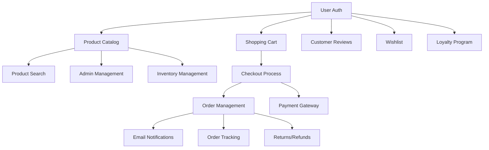

# Feature Implementation Tracking

## Quick Status Overview

### Phase 1: MVP (Months 1-3)
| Feature | Status | Priority | Assigned | PR # | Notes |
|---------|--------|----------|----------|------|-------|
| User Registration & Auth | 🔴 Not Started | Critical | - | - | First priority |
| Product Catalog | 🔴 Not Started | Critical | - | - | Depends on auth |
| Product Search & Filtering | 🔴 Not Started | Critical | - | - | Requires Elasticsearch |
| Shopping Cart | 🔴 Not Started | Critical | - | - | Session + persistent |
| Basic Checkout | 🔴 Not Started | Critical | - | - | Needs cart complete |
| Order Management | 🔴 Not Started | Critical | - | - | After checkout |
| Admin Product Management | 🔴 Not Started | Critical | - | - | Admin dashboard |

### Phase 2: Enhanced (Months 4-6)
| Feature | Status | Priority | Assigned | PR # | Notes |
|---------|--------|----------|----------|------|-------|
| Payment Gateway | 🔴 Not Started | High | - | - | Stripe + PayPal |
| Inventory Management | 🔴 Not Started | High | - | - | Real-time tracking |
| Customer Reviews | 🔴 Not Started | Medium | - | - | With moderation |
| Wishlist | 🔴 Not Started | Medium | - | - | User feature |
| Email Notifications | 🔴 Not Started | High | - | - | Transactional first |
| Order Tracking | 🔴 Not Started | High | - | - | Carrier integration |
| Returns/Refunds | 🔴 Not Started | High | - | - | Self-service |

### Phase 3: Advanced (Months 7-9)
| Feature | Status | Priority | Assigned | PR # | Notes |
|---------|--------|----------|----------|------|-------|
| Recommendation Engine | 🔴 Not Started | Medium | - | - | AI/ML based |
| Advanced Search | 🔴 Not Started | Medium | - | - | NLP capabilities |
| Multi-Vendor | 🔴 Not Started | Low | - | - | Marketplace |
| Loyalty Program | 🔴 Not Started | Medium | - | - | Points system |
| Live Chat | 🔴 Not Started | Medium | - | - | Customer support |
| Mobile Apps | 🔴 Not Started | Low | - | - | iOS + Android |
| B2B Portal | 🔴 Not Started | Low | - | - | Enterprise features |

### Phase 4: Optimization (Months 10-12)
| Feature | Status | Priority | Assigned | PR # | Notes |
|---------|--------|----------|----------|------|-------|
| Performance Optimization | 🔴 Not Started | High | - | - | Continuous |
| SEO Enhancements | 🔴 Not Started | High | - | - | Organic traffic |
| Analytics Dashboard | 🔴 Not Started | Medium | - | - | Business intelligence |
| A/B Testing | 🔴 Not Started | Low | - | - | Experimentation |
| Marketing Automation | 🔴 Not Started | Low | - | - | Campaign management |
| Advanced Reporting | 🔴 Not Started | Medium | - | - | Enterprise reports |
| API Platform | 🔴 Not Started | Low | - | - | Third-party integrations |

## Implementation Order

### Sprint 1-2: Foundation
1. **feature/auth-system** - User registration and authentication
2. **feature/database-setup** - PostgreSQL schema and migrations
3. **feature/api-structure** - Base API setup with Clean Architecture

### Sprint 3-4: Product Management
1. **feature/product-catalog** - Product and category entities
2. **feature/admin-products** - Admin product management
3. **feature/product-frontend** - Product listing and detail pages

### Sprint 5-6: Shopping Experience
1. **feature/search-elasticsearch** - Search infrastructure
2. **feature/shopping-cart** - Cart functionality
3. **feature/checkout-process** - Basic checkout flow

### Sprint 7-8: Order Processing
1. **feature/order-management** - Order creation and tracking
2. **feature/payment-integration** - Stripe/PayPal integration
3. **feature/email-notifications** - Transactional emails

### Sprint 9-10: Inventory & Fulfillment
1. **feature/inventory-system** - Stock management
2. **feature/shipping-integration** - Carrier APIs
3. **feature/returns-management** - Return/refund flow

### Sprint 11-12: Customer Features
1. **feature/customer-reviews** - Review system
2. **feature/wishlist** - Save for later
3. **feature/loyalty-program** - Points and rewards

## Feature Dependencies



## Git Branch Naming Convention

```
feature/[feature-name]      # New features
bugfix/[issue-description]  # Bug fixes
hotfix/[urgent-fix]         # Production hotfixes
chore/[task-description]    # Maintenance tasks
docs/[documentation-update] # Documentation only
```

## PR Template

```markdown
## Description
Brief description of the feature/fix

## Type of Change
- [ ] Bug fix
- [ ] New feature
- [ ] Breaking change
- [ ] Documentation update

## Testing
- [ ] Unit tests pass
- [ ] Integration tests pass
- [ ] E2E tests pass (if applicable)
- [ ] Manual testing completed

## Checklist
- [ ] Code follows style guidelines
- [ ] Self-review completed
- [ ] Documentation updated
- [ ] No new warnings
- [ ] Tests added/updated
- [ ] All tests passing

## Screenshots (if applicable)
[Add screenshots here]

## Related Issues
Closes #[issue number]
```

## Definition of Ready

Before starting a feature:
- [ ] User story defined and accepted
- [ ] Acceptance criteria documented
- [ ] Technical design reviewed
- [ ] Dependencies identified
- [ ] Test scenarios defined
- [ ] API contracts agreed (if applicable)

## Definition of Done

Before marking complete:
- [ ] Code complete and reviewed
- [ ] Unit tests written (>80% coverage)
- [ ] Integration tests written
- [ ] E2E tests written (critical paths)
- [ ] Documentation updated
- [ ] No critical bugs
- [ ] Performance requirements met
- [ ] Security review passed (if applicable)
- [ ] Deployed to staging
- [ ] Product owner accepted

## Weekly Progress Report Template

```markdown
# Week [X] Progress Report

## Completed
- Feature X: [Status and notes]
- Feature Y: [Status and notes]

## In Progress
- Feature Z: [% complete, blockers]

## Blocked
- Issue: [Description and needed resolution]

## Next Week
- Planned features to start/complete

## Metrics
- Velocity: X story points
- Bug count: X critical, Y major, Z minor
- Test coverage: X%
- Build success rate: X%
```

## Risk Items

### Technical Risks
- **Payment Integration**: PCI compliance complexity
- **Search Performance**: Elasticsearch scaling
- **Real-time Inventory**: Concurrency handling
- **Multi-vendor**: Data isolation complexity

### Timeline Risks
- **Dependencies**: External API availability
- **Scope Creep**: Feature additions mid-sprint
- **Testing Time**: E2E test execution time
- **Third-party**: Payment gateway approval

## Communication Channels

- **Daily Standup**: 9:00 AM
- **Sprint Planning**: Mondays, 2 weeks
- **Sprint Review**: End of sprint
- **Retrospective**: After review
- **Slack Channels**:
  - #climacool-dev - Development discussion
  - #climacool-pr - PR notifications
  - #climacool-releases - Release notes
  - #climacool-support - Production issues

## Environments

| Environment | Purpose | URL | Deploy Trigger |
|------------|---------|-----|----------------|
| Local | Development | http://localhost:4200 | Manual |
| Dev | Integration testing | https://dev.climacool.com | PR merge to develop |
| Staging | UAT/Demo | https://staging.climacool.com | Release branch |
| Production | Live site | https://www.climacool.com | Tag release |

## Key Metrics to Track

### Development Metrics
- Sprint velocity
- Cycle time
- Lead time
- Code coverage
- Technical debt ratio

### Quality Metrics
- Defect density
- Defect escape rate
- Test automation coverage
- Mean time to recovery (MTTR)

### Business Metrics
- Feature adoption rate
- Page load time
- Conversion rate
- Customer satisfaction score