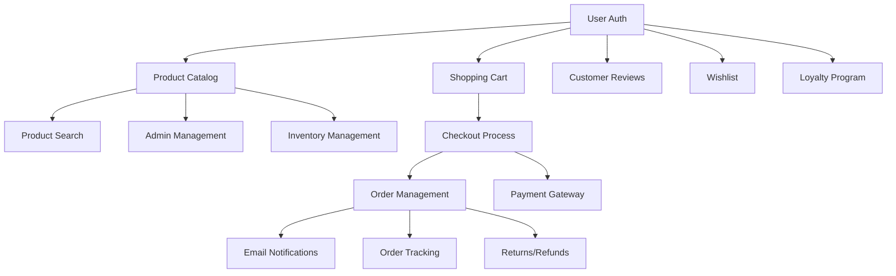

# Feature Implementation Tracking

## Quick Status Overview

### CRITICAL: Build & CI/CD Fixes (IMMEDIATE PRIORITY)
| Issue | Status | Priority | Impact | Notes |
|-------|--------|----------|--------|-------|
| Backend Build Failures | ✅ Fixed | P0 | Blocking all deployments | PaymentMethodType enum naming conflicts resolved |
| Admin Portal Build | ✅ Fixed | P0 | CI failing | CI pipeline only builds customer portal - issue was already resolved |
| E2E Tests Skipped | 🟡 High | P1 | No integration testing | Should work now that backend builds successfully |
| Docker Build Skipped | 🟡 High | P1 | No containerization | Should work now that backend builds successfully |
| Frontend Lint Checks | ✅ Fixed | - | - | Made mandatory in CI |
| Customer Portal Build | ✅ Fixed | - | - | TypeScript errors resolved |

## Build Issue Resolution Plan

### ✅ RESOLVED: Priority 0 Backend Build Issues
**Problem**: PaymentMethodType enum naming conflicts causing compilation failures
- PaymentMethod entity and PaymentMethod enum had naming conflicts
- PaymentMethodType enum was missing
- Services were using inconsistent enum types

**Solution Applied**:
1. ✅ Added missing PaymentMethodType enum to PaymentEnums.cs
2. ✅ Renamed PaymentMethod enum to PaymentMethodEnum to avoid conflicts
3. ✅ Updated Payment entity to use PaymentMethodEnum
4. ✅ Updated StripePaymentService to use PaymentMethodEnum
5. ✅ Updated PayPalPaymentService to use PaymentMethodEnum
6. ✅ Updated all test files to use PaymentMethodEnum
7. ✅ Fixed EntityFramework version conflicts in test project
8. ✅ Verified backend API builds successfully with 0 warnings and 0 errors

**Result**: Backend now builds successfully and is ready for deployment.

### ✅ RESOLVED: Admin Portal CI Issue
**Problem**: CI expects admin-portal that doesn't exist
**Status**: ALREADY RESOLVED - Investigation revealed that the CI pipeline (.github/workflows/ci.yml) only references the customer portal, not admin portal. The issue description in this tracking document was outdated.

**Verification**:
- ✅ Confirmed CI pipeline only builds `frontend-customer-portal-build-test` job
- ✅ No admin portal references found in CI configuration
- ✅ Docker build only targets customer portal
- ✅ No admin portal directories or references in codebase
```

### Priority 1: E2E Tests
**Problem**: E2E tests fail due to backend not building
**Solution**: Fix backend first, then update E2E tests

**Action Steps**:
```
1. [ ] Wait for backend build fix
2. [ ] Update E2E test fixtures if needed
3. [ ] Run E2E tests locally
4. [ ] Fix any failing tests
```

### Phase 1: MVP (Months 1-3)
| Feature | Status | Priority | Assigned | PR # | Notes |
|---------|--------|----------|----------|------|-------|
| User Registration & Auth | ✅ Completed | Critical | - | #2, #3 | JWT auth with refresh tokens |
| Product Catalog | ✅ Completed | Critical | - | #4 | Backend + Frontend with categories |
| Product Search & Filtering | ✅ Completed | Critical | - | #TBD | Enhanced search with autocomplete, filters, and suggestions. Backend API implemented with database search (OpenSearch ready) |
| Shopping Cart | ✅ Completed | Critical | - | #6 | Full implementation: Backend + Frontend + E2E tests - PR ready for merge |
| Basic Checkout | ✅ Completed | Critical | - | #TBD | Complete implementation: Backend APIs + Frontend (NgRx, multi-step checkout) + E2E tests |
| Order Management | ✅ Completed | Critical | - | #TBD | Complete implementation: Backend (status tracking, history) + Frontend (dashboard, details, admin) + E2E tests |
| Admin Product Management | ✅ Completed | Critical | - | #TBD | Complete implementation: Backend (CRUD, bulk ops, images) + Frontend (list, form, inventory) + E2E tests |

### Phase 2: Enhanced (Months 4-6) - PAYMENT GATEWAY BREAKDOWN

#### Payment Gateway Implementation Tasks (Priority Order)
| Task | Status | Complexity | Estimated Hours | Dependencies | Notes |
|------|--------|------------|-----------------|--------------|-------|
| **Backend - Core Payment Infrastructure** |
| Payment Domain Entities | ✅ Completed | Low | 2 | - | Payment, PaymentMethod, Refund entities created |
| Payment DTOs & Enums | ✅ Completed | Low | 1 | Entities | PaymentDtos.cs, PaymentEnums.cs created |
| Payment Repository Interface | 🟡 In Progress | Low | 2 | Entities | IPaymentRepository, IPaymentMethodRepository |
| Payment Repository Implementation | 🔴 Not Started | Medium | 4 | Repository Interface | EF Core implementation |
| Database Migrations | 🔴 Not Started | Low | 2 | Entities | Add payment tables to database |
| **Backend - Stripe Integration** |
| Stripe Service Implementation | 🔴 Not Started | High | 8 | DTOs | PaymentService with Stripe SDK |
| Stripe Payment Intent API | 🔴 Not Started | Medium | 4 | Stripe Service | Create, confirm, capture payments |
| Stripe Payment Methods API | 🔴 Not Started | Medium | 4 | Stripe Service | Save, list, delete cards |
| Stripe Webhook Handler | 🔴 Not Started | Medium | 4 | Stripe Service | Handle payment events |
| Stripe Configuration | 🔴 Not Started | Low | 1 | - | appsettings.json setup |
| **Backend - PayPal Integration** |
| PayPal Service Implementation | 🔴 Not Started | High | 8 | DTOs | PayPal SDK integration |
| PayPal Orders API | 🔴 Not Started | Medium | 4 | PayPal Service | Create and capture orders |
| PayPal Webhook Handler | 🔴 Not Started | Medium | 4 | PayPal Service | Handle PayPal events |
| **Backend - API Layer** |
| Payment Controller | 🔴 Not Started | Medium | 4 | Services | REST endpoints for payments |
| Payment Method Controller | 🔴 Not Started | Low | 2 | Services | Manage saved payment methods |
| Refund Controller | 🔴 Not Started | Low | 2 | Services | Process refunds |
| Webhook Controller | 🔴 Not Started | Low | 2 | Services | Stripe/PayPal webhooks |
| **Frontend - Payment Components** |
| Payment Service (Angular) | 🔴 Not Started | Medium | 4 | - | HTTP service for payment APIs |
| Payment Models | 🔴 Not Started | Low | 1 | - | TypeScript interfaces |
| Stripe Elements Component | 🔴 Not Started | High | 6 | Stripe.js | Card input with Stripe Elements |
| Payment Method List Component | 🔴 Not Started | Medium | 4 | - | Display saved cards |
| Add Payment Method Component | 🔴 Not Started | Medium | 4 | Stripe Elements | Add new card form |
| Payment Selection Component | 🔴 Not Started | Medium | 3 | - | Choose payment method at checkout |
| **Frontend - Checkout Integration** |
| Checkout Payment Step | 🔴 Not Started | High | 6 | Payment Components | Integrate into checkout flow |
| Payment Confirmation UI | 🔴 Not Started | Low | 2 | - | Success/failure screens |
| 3D Secure Handling | 🔴 Not Started | Medium | 4 | Stripe Elements | Handle authentication |
| **Frontend - Order & Refunds** |
| Order Payment Status | 🔴 Not Started | Low | 2 | - | Display payment info in orders |
| Refund Request UI | 🔴 Not Started | Medium | 3 | - | Request refund form |
| Admin Refund Management | 🔴 Not Started | Medium | 4 | - | Process refunds admin panel |
| **Testing** |
| Payment Service Unit Tests | 🔴 Not Started | Medium | 4 | Service Implementation | Mock Stripe/PayPal |
| Repository Unit Tests | 🔴 Not Started | Low | 2 | Repository | Database tests |
| Controller Integration Tests | 🔴 Not Started | Medium | 4 | Controllers | API endpoint tests |
| Frontend Component Tests | 🔴 Not Started | Medium | 4 | Components | Angular component tests |
| E2E Payment Flow Tests | 🔴 Not Started | High | 6 | All components | Full checkout with payment |
| **Documentation & Security** |
| API Documentation | 🔴 Not Started | Low | 2 | Controllers | Swagger docs |
| Security Review | 🔴 Not Started | High | 4 | All components | PCI compliance check |
| Deployment Configuration | 🔴 Not Started | Low | 2 | - | Environment variables |

**Total Estimated Hours**: ~130 hours (16-20 days of focused work)

#### Other Phase 2 Features
| Feature | Status | Priority | Assigned | PR # | Notes |
|---------|--------|----------|----------|------|-------|
| Inventory Management | 🔴 Not Started | High | - | - | Real-time tracking |
| Customer Reviews | 🔴 Not Started | Medium | - | - | With moderation |
| Wishlist | 🔴 Not Started | Medium | - | - | User feature |
| Email Notifications | 🔴 Not Started | High | - | - | Transactional first |
| Order Tracking | 🔴 Not Started | High | - | - | Carrier integration |
| Returns/Refunds | 🔴 Not Started | High | - | - | Self-service (depends on Payment Gateway) |

### Phase 3: Advanced (Months 7-9)
| Feature | Status | Priority | Assigned | PR # | Notes |
|---------|--------|----------|----------|------|-------|
| Recommendation Engine | 🔴 Not Started | Medium | - | - | AI/ML based |
| Advanced Search | 🔴 Not Started | Medium | - | - | NLP capabilities |
| Multi-Vendor | 🔴 Not Started | Low | - | - | Marketplace |
| Loyalty Program | 🔴 Not Started | Medium | - | - | Points system |
| Live Chat | 🔴 Not Started | Medium | - | - | Customer support |
| Mobile Apps | 🔴 Not Started | Low | - | - | iOS + Android |
| B2B Portal | 🔴 Not Started | Low | - | - | Enterprise features |

### Phase 4: UI/UX Modernization (Priority Enhancement)
| Feature | Status | Priority | Assigned | PR # | Notes |
|---------|--------|----------|----------|------|-------|
| Homepage Redesign | 🔴 Not Started | High | - | - | Modern hero section with Tailwind |
| Product Listing Enhancement | 🔴 Not Started | High | - | - | Card redesign, improved filters UI |
| Product Detail Page Redesign | 🔴 Not Started | High | - | - | Image gallery, reviews integration |
| Shopping Cart UI/UX | 🔴 Not Started | High | - | - | Slide-out cart, quantity controls |
| Checkout Process Redesign | 🔴 Not Started | High | - | - | Multi-step wizard, progress indicators |
| Dashboard Modernization | 🔴 Not Started | High | - | - | Clean admin interface |
| Mobile-First Optimization | 🔴 Not Started | Critical | - | - | Touch-friendly, responsive design |
| Dark Mode Support | 🔴 Not Started | Medium | - | - | System preference detection |
| Accessibility Enhancements | 🔴 Not Started | High | - | - | WCAG 2.1 AA compliance |
| Micro-interactions & Animations | 🔴 Not Started | Medium | - | - | Loading states, hover effects |

### Phase 5: Optimization (Months 10-12)
| Feature | Status | Priority | Assigned | PR # | Notes |
|---------|--------|----------|----------|------|-------|
| Performance Optimization | 🔴 Not Started | High | - | - | Continuous |
| SEO Enhancements | 🔴 Not Started | High | - | - | Organic traffic |
| Analytics Dashboard | 🔴 Not Started | Medium | - | - | Business intelligence |
| A/B Testing | 🔴 Not Started | Low | - | - | Experimentation |
| Marketing Automation | 🔴 Not Started | Low | - | - | Campaign management |
| Advanced Reporting | 🔴 Not Started | Medium | - | - | Enterprise reports |
| API Platform | 🔴 Not Started | Low | - | - | Third-party integrations |

## Implementation Order

### Sprint 1-2: Foundation
1. **feature/auth-system** - User registration and authentication
2. **feature/database-setup** - PostgreSQL schema and migrations
3. **feature/api-structure** - Base API setup with Clean Architecture

### Sprint 3-4: Product Management
1. **feature/product-catalog** - Product and category entities
2. **feature/admin-products** - Admin product management
3. **feature/product-frontend** - Product listing and detail pages

### Sprint 5-6: Shopping Experience
1. **feature/search-elasticsearch** - Search infrastructure
2. **feature/shopping-cart** - Cart functionality
3. **feature/checkout-process** - Basic checkout flow

### Sprint 7-8: Order Processing
1. **feature/order-management** - Order creation and tracking
2. **feature/payment-integration** - Stripe/PayPal integration
3. **feature/email-notifications** - Transactional emails

### Sprint 9-10: Inventory & Fulfillment
1. **feature/inventory-system** - Stock management
2. **feature/shipping-integration** - Carrier APIs
3. **feature/returns-management** - Return/refund flow

### Sprint 11-12: Customer Features
1. **feature/customer-reviews** - Review system
2. **feature/wishlist** - Save for later
3. **feature/loyalty-program** - Points and rewards

## Comprehensive E2E Test Plan

### Test Coverage Status
| Test Suite | Status | Priority | Coverage | Notes |
|------------|--------|----------|----------|-------|
| Authentication | 🔴 Not Started | P0 | 0% | Critical user flows |
| Product Browsing | 🔴 Not Started | P0 | 0% | Core shopping experience |
| Shopping Cart | 🟡 Partial | P0 | 30% | Basic UI tests exist |
| Checkout Process | 🔴 Not Started | P0 | 0% | Critical purchase flow |
| Order Management | 🔴 Not Started | P1 | 0% | Post-purchase experience |
| Admin Product Management | 🔴 Not Started | P1 | 0% | Admin workflows |
| Payment Flow | 🔴 Not Started | P0 | 0% | Payment processing |
| Search & Filtering | 🔴 Not Started | P1 | 0% | Product discovery |

### Detailed E2E Test Scenarios

#### 1. Authentication Test Suite (`auth.e2e.cy.ts`)
**Priority: P0 - Critical**

##### User Registration Journey
- ✅ Navigate to registration page
- ✅ Fill valid registration form
- ✅ Submit and verify success message
- ✅ Verify email sent notification
- ✅ Check user redirected to login
- ✅ Verify account created in database
- ✅ Test password strength requirements
- ✅ Test duplicate email rejection
- ✅ Test form validation errors

##### User Login Journey
- ✅ Navigate to login page
- ✅ Enter valid credentials
- ✅ Verify successful login redirect
- ✅ Check JWT token storage
- ✅ Verify user menu appears
- ✅ Test invalid credentials error
- ✅ Test remember me functionality
- ✅ Test session persistence

##### Password Reset Journey
- ✅ Click forgot password link
- ✅ Enter registered email
- ✅ Verify reset email sent message
- ✅ Navigate to reset link (mock)
- ✅ Enter new password
- ✅ Verify password changed
- ✅ Login with new password

##### Logout Journey
- ✅ Click logout from user menu
- ✅ Verify redirect to home
- ✅ Check token cleared
- ✅ Verify protected routes blocked

#### 2. Product Browsing Test Suite (`product-browsing.e2e.cy.ts`)
**Priority: P0 - Critical**

##### Product Catalog Journey
- ✅ Navigate to products page
- ✅ Verify products load
- ✅ Check product cards display correctly
- ✅ Verify pagination works
- ✅ Test sorting (price, name, rating)
- ✅ Verify category navigation
- ✅ Check product images load
- ✅ Test grid/list view toggle

##### Product Details Journey
- ✅ Click on product card
- ✅ Verify product details page loads
- ✅ Check all product information displays
- ✅ Verify image gallery works
- ✅ Test variant selection (size, color)
- ✅ Check stock availability display
- ✅ Verify price updates with variants
- ✅ Test product specifications tab

#### 3. Shopping Cart Test Suite (`shopping-cart-full.e2e.cy.ts`)
**Priority: P0 - Critical**

##### Add to Cart Journey
- ✅ Browse to product
- ✅ Select product variant
- ✅ Add to cart
- ✅ Verify cart icon updates
- ✅ Check cart sidebar opens
- ✅ Verify product in cart
- ✅ Test quantity limits
- ✅ Verify cart persistence

##### Cart Management Journey
- ✅ Open cart sidebar
- ✅ Update item quantity
- ✅ Verify price recalculation
- ✅ Remove item from cart
- ✅ Verify cart updates
- ✅ Test empty cart state
- ✅ Apply discount code
- ✅ Verify discount applied

##### Cart Page Journey
- ✅ Navigate to cart page
- ✅ Verify all items display
- ✅ Test bulk quantity update
- ✅ Verify subtotal calculation
- ✅ Check shipping estimate
- ✅ Test save for later
- ✅ Verify cart summary
- ✅ Proceed to checkout button

#### 4. Checkout Process Test Suite (`checkout.e2e.cy.ts`)
**Priority: P0 - Critical**

##### Guest Checkout Journey
- ✅ Add items to cart
- ✅ Proceed to checkout
- ✅ Enter email for guest checkout
- ✅ Fill shipping address
- ✅ Select shipping method
- ✅ Enter payment details
- ✅ Review order summary
- ✅ Place order
- ✅ Verify confirmation page
- ✅ Check order confirmation email

##### Registered User Checkout Journey
- ✅ Login first
- ✅ Add items to cart
- ✅ Proceed to checkout
- ✅ Select saved address
- ✅ Add new address option
- ✅ Select saved payment method
- ✅ Apply loyalty points
- ✅ Review and place order
- ✅ Verify order in account

##### Multi-Step Checkout Validation
- ✅ Test step navigation
- ✅ Verify step completion
- ✅ Test back button behavior
- ✅ Verify form persistence
- ✅ Test validation on each step
- ✅ Check step indicators
- ✅ Test direct step access

#### 5. Order Management Test Suite (`order-management.e2e.cy.ts`)
**Priority: P1 - High**

##### Order History Journey
- ✅ Login to account
- ✅ Navigate to orders page
- ✅ Verify orders list displays
- ✅ Check order filtering (status, date)
- ✅ Test order search
- ✅ Verify pagination
- ✅ Check order status badges

##### Order Details Journey
- ✅ Click on order number
- ✅ Verify order details load
- ✅ Check all order information
- ✅ Verify line items display
- ✅ Check shipping information
- ✅ Verify payment details
- ✅ Test invoice download
- ✅ Check tracking information

##### Order Actions Journey
- ✅ Test reorder functionality
- ✅ Verify items added to cart
- ✅ Test cancel order (if pending)
- ✅ Verify cancellation confirmation
- ✅ Test return request
- ✅ Fill return reason
- ✅ Verify return initiated

#### 6. Admin Product Management Test Suite (`admin-products.e2e.cy.ts`)
**Priority: P1 - High**

##### Admin Login Journey
- ✅ Navigate to admin login
- ✅ Enter admin credentials
- ✅ Verify admin dashboard access
- ✅ Check admin menu items
- ✅ Verify role-based access

##### Product Creation Journey
- ✅ Navigate to add product
- ✅ Fill product basic info
- ✅ Add product images
- ✅ Set pricing and inventory
- ✅ Add product variants
- ✅ Set categories and tags
- ✅ Configure shipping
- ✅ Save and verify product created
- ✅ Check product appears in catalog

##### Product Editing Journey
- ✅ Navigate to products list
- ✅ Search for product
- ✅ Click edit product
- ✅ Update product details
- ✅ Change images
- ✅ Update inventory
- ✅ Save changes
- ✅ Verify updates reflected

##### Bulk Operations Journey
- ✅ Select multiple products
- ✅ Test bulk price update
- ✅ Test bulk category change
- ✅ Test bulk delete
- ✅ Verify confirmation dialog
- ✅ Check operations completed

##### Inventory Management Journey
- ✅ Navigate to inventory page
- ✅ Check stock levels display
- ✅ Test low stock filter
- ✅ Update stock quantity
- ✅ Test stock history
- ✅ Set reorder points
- ✅ Verify stock alerts

#### 7. Payment Flow Test Suite (`payment-flow-full.e2e.cy.ts`)
**Priority: P0 - Critical**

##### Credit Card Payment Journey
- ✅ Reach payment step in checkout
- ✅ Select credit card option
- ✅ Enter card details (test card)
- ✅ Verify card validation
- ✅ Submit payment
- ✅ Handle 3D Secure (mock)
- ✅ Verify payment success
- ✅ Check order confirmation

##### Saved Payment Method Journey
- ✅ Login with saved cards
- ✅ Select saved payment method
- ✅ Enter CVV only
- ✅ Process payment
- ✅ Verify payment success

##### Payment Method Management
- ✅ Navigate to payment methods
- ✅ Add new payment method
- ✅ Verify card saved
- ✅ Set default payment method
- ✅ Remove payment method
- ✅ Verify removal confirmation

##### Payment Failure Scenarios
- ✅ Test declined card
- ✅ Verify error message
- ✅ Test retry payment
- ✅ Test insufficient funds
- ✅ Verify order not created

#### 8. Search & Filtering Test Suite (`search-filtering.e2e.cy.ts`)
**Priority: P1 - High**

##### Search Journey
- ✅ Enter search term
- ✅ Verify search results
- ✅ Check result relevance
- ✅ Test search suggestions
- ✅ Test search history
- ✅ Test no results state
- ✅ Test special characters
- ✅ Test search pagination

##### Category Filtering Journey
- ✅ Select category
- ✅ Verify products filtered
- ✅ Check breadcrumbs
- ✅ Test subcategories
- ✅ Test multiple categories
- ✅ Verify category counts

##### Advanced Filtering Journey
- ✅ Apply price range filter
- ✅ Select brand filters
- ✅ Choose size options
- ✅ Select color filters
- ✅ Apply rating filter
- ✅ Test filter combinations
- ✅ Verify filter tags
- ✅ Test clear all filters

##### Sort and Display Options
- ✅ Test sort by price
- ✅ Test sort by popularity
- ✅ Test sort by rating
- ✅ Test sort by newest
- ✅ Change items per page
- ✅ Test view mode toggle

### Test Data Management

#### Required Test Data Sets
1. **Users**
   - Regular user account
   - Admin user account
   - Guest checkout data
   - Multiple test addresses
   - Test payment methods

2. **Products**
   - Simple products (10+)
   - Variable products (5+)
   - Out of stock products
   - Sale products
   - Different categories

3. **Orders**
   - Completed orders
   - Pending orders
   - Cancelled orders
   - Refunded orders

#### Database Seeding Strategy
```javascript
// cypress/support/commands.js
Cypress.Commands.add('seedDatabase', () => {
  cy.task('db:seed');
});

Cypress.Commands.add('cleanDatabase', () => {
  cy.task('db:clean');
});

Cypress.Commands.add('createTestUser', (userData) => {
  cy.task('db:createUser', userData);
});

Cypress.Commands.add('createTestProducts', (count) => {
  cy.task('db:createProducts', count);
});
```

### Test Execution Strategy

#### Execution Order
1. **Smoke Tests** - Critical paths only (5 min)
2. **Authentication** - Must pass before others (10 min)
3. **Core Shopping** - Products, Cart, Checkout (20 min)
4. **Extended Features** - Orders, Admin, Search (15 min)
5. **Payment Tests** - Isolated payment flows (10 min)

#### Parallel Execution Groups
```javascript
// cypress.config.js
{
  "groups": {
    "auth": ["auth.e2e.cy.ts"],
    "shopping": ["product-browsing.e2e.cy.ts", "shopping-cart-full.e2e.cy.ts"],
    "checkout": ["checkout.e2e.cy.ts", "payment-flow-full.e2e.cy.ts"],
    "account": ["order-management.e2e.cy.ts"],
    "admin": ["admin-products.e2e.cy.ts"],
    "search": ["search-filtering.e2e.cy.ts"]
  }
}
```

#### CI/CD Integration
```yaml
# .github/workflows/e2e-tests.yml
e2e-tests:
  runs-on: ubuntu-latest
  strategy:
    matrix:
      group: [auth, shopping, checkout, account, admin, search]
  steps:
    - name: Run E2E Tests - ${{ matrix.group }}
      run: npm run cy:run -- --group ${{ matrix.group }}
```

### Success Metrics
- **Coverage Target**: 80% of critical user journeys
- **Execution Time**: < 60 minutes for full suite
- **Stability**: < 1% flaky test rate
- **Maintenance**: < 2 hours/week for updates

### Implementation Priority
1. **Week 1**: Authentication + Product Browsing
2. **Week 2**: Shopping Cart + Checkout
3. **Week 3**: Payment Flow + Order Management
4. **Week 4**: Admin Features + Search/Filtering

## Feature Dependencies



## Git Branch Naming Convention

```
feature/[feature-name]      # New features
bugfix/[issue-description]  # Bug fixes
hotfix/[urgent-fix]         # Production hotfixes
chore/[task-description]    # Maintenance tasks
docs/[documentation-update] # Documentation only
```

## PR Template

```markdown
## Description
Brief description of the feature/fix

## Type of Change
- [ ] Bug fix
- [ ] New feature
- [ ] Breaking change
- [ ] Documentation update

## Testing
- [ ] Unit tests pass
- [ ] Integration tests pass
- [ ] E2E tests pass (if applicable)
- [ ] Manual testing completed

## Checklist
- [ ] Code follows style guidelines
- [ ] Self-review completed
- [ ] Documentation updated
- [ ] No new warnings
- [ ] Tests added/updated
- [ ] All tests passing

## Screenshots (if applicable)
[Add screenshots here]

## Related Issues
Closes #[issue number]
```

## Definition of Ready

Before starting a feature:
- [ ] User story defined and accepted
- [ ] Acceptance criteria documented
- [ ] Technical design reviewed
- [ ] Dependencies identified
- [ ] Test scenarios defined
- [ ] API contracts agreed (if applicable)

## Definition of Done

Before marking complete:
- [ ] Code complete and reviewed
- [ ] Unit tests written (>80% coverage)
- [ ] Integration tests written
- [ ] E2E tests written (critical paths)
- [ ] Documentation updated
- [ ] No critical bugs
- [ ] Performance requirements met
- [ ] Security review passed (if applicable)
- [ ] Deployed to staging
- [ ] Product owner accepted

## Weekly Progress Report Template

```markdown
# Week [X] Progress Report

## Completed
- Feature X: [Status and notes]
- Feature Y: [Status and notes]

## In Progress
- Feature Z: [% complete, blockers]

## Blocked
- Issue: [Description and needed resolution]

## Next Week
- Planned features to start/complete

## Metrics
- Velocity: X story points
- Bug count: X critical, Y major, Z minor
- Test coverage: X%
- Build success rate: X%
```

## Risk Items

### Technical Risks
- **Payment Integration**: PCI compliance complexity
- **Search Performance**: Elasticsearch scaling
- **Real-time Inventory**: Concurrency handling
- **Multi-vendor**: Data isolation complexity

### Timeline Risks
- **Dependencies**: External API availability
- **Scope Creep**: Feature additions mid-sprint
- **Testing Time**: E2E test execution time
- **Third-party**: Payment gateway approval

## Communication Channels

- **Daily Standup**: 9:00 AM
- **Sprint Planning**: Mondays, 2 weeks
- **Sprint Review**: End of sprint
- **Retrospective**: After review
- **Slack Channels**:
  - #climacool-dev - Development discussion
  - #climacool-pr - PR notifications
  - #climacool-releases - Release notes
  - #climacool-support - Production issues

## Environments

| Environment | Purpose | URL | Deploy Trigger |
|------------|---------|-----|----------------|
| Local | Development | http://localhost:4200 | Manual |
| Dev | Integration testing | https://dev.climacool.com | PR merge to develop |
| Staging | UAT/Demo | https://staging.climacool.com | Release branch |
| Production | Live site | https://www.climacool.com | Tag release |

## Key Metrics to Track

### Development Metrics
- Sprint velocity
- Cycle time
- Lead time
- Code coverage
- Technical debt ratio

### Quality Metrics
- Defect density
- Defect escape rate
- Test automation coverage
- Mean time to recovery (MTTR)

### Business Metrics
- Feature adoption rate
- Page load time
- Conversion rate
- Customer satisfaction score

---

# UI/UX Modernization Comprehensive Plan

## Overview
Transform ClimaCool's user interface using Tailwind CSS to create a modern, accessible, and delightful user experience across all touchpoints. This plan focuses on visual excellence, usability, and performance.

## Design System Foundation

### Color Palette (Tailwind-based)
```css
Primary Brand Colors:
- Primary: #0D47A1 (blue-800) - Trust, professionalism
- Secondary: #1565C0 (blue-700) - Interactive elements
- Accent: #42A5F5 (blue-400) - Highlights, CTAs

Neutral Colors:
- Gray-50 to Gray-900 for text hierarchy
- White/Gray-50 for backgrounds
- Gray-200/300 for borders and dividers

Semantic Colors:
- Success: Green-500 (#10B981)
- Warning: Amber-500 (#F59E0B) 
- Error: Red-500 (#EF4444)
- Info: Blue-500 (#3B82F6)
```

### Typography Scale
```css
Display: text-6xl/5xl (48-60px) - Hero headings
Heading 1: text-4xl (36px) - Page titles
Heading 2: text-3xl (30px) - Section titles
Heading 3: text-2xl (24px) - Subsection titles
Heading 4: text-xl (20px) - Component titles
Body Large: text-lg (18px) - Lead text
Body: text-base (16px) - Main content
Body Small: text-sm (14px) - Secondary text
Caption: text-xs (12px) - Captions, labels
```

### Spacing System
- Use Tailwind's 4px base unit spacing scale
- Container max-width: max-w-7xl (1280px)
- Section padding: py-16 (64px) desktop, py-8 (32px) mobile
- Component padding: p-6 (24px) desktop, p-4 (16px) mobile

## Page-by-Page Redesign Plan

### 1. Homepage (`/`) - Landing Experience
**Current Issues:** Basic layout, weak visual hierarchy, poor mobile experience
**Modernization Goals:** Stunning first impression, clear value proposition, optimized conversions

**Components to Redesign:**
- **Hero Section**
  - Full-viewport gradient background with subtle pattern
  - Compelling headline with text-4xl/5xl typography
  - Hero product image with floating UI elements
  - Primary CTA button with micro-animations
  - Trust indicators (certifications, reviews)

- **Product Showcase**
  - Featured products grid with hover animations
  - Category cards with icon integration
  - "Shop by Room" visual selector
  - Testimonials carousel with customer photos

- **Value Propositions**
  - Icon-driven benefits section
  - Statistics counter with counting animations
  - Installation service highlights
  - Warranty and support information

**Technical Implementation:**
```typescript
// Hero component with advanced animations
interface HeroProps {
  backgroundImage: string;
  headline: string;
  subheadline: string;
  ctaText: string;
  secondaryCtaText?: string;
}

// Featured products with lazy loading
interface FeaturedProductsProps {
  products: Product[];
  layout: 'grid' | 'carousel';
  showCategories: boolean;
}
```

### 2. Product Listing (`/products`) - Discovery Experience
**Current Status:** Already enhanced with search - build upon this
**Modernization Goals:** Seamless product discovery, advanced filtering, delightful interactions

**Enhanced Components:**
- **Advanced Filter Sidebar**
  - Collapsible filter groups with smooth animations
  - Range sliders for price/size with custom styling
  - Multi-select dropdowns with search
  - Applied filters chips with remove animations
  - "Save Search" functionality

- **Product Grid/List**
  - Card hover effects with smooth transforms
  - Quick-view modal with product details
  - Wishlist heart icon with fill animation
  - Stock status badges with semantic colors
  - Image lazy loading with skeleton screens

- **Enhanced Search Results**
  - Search suggestions with keyboard navigation
  - No results state with suggested alternatives
  - Sorting dropdown with clear visual feedback
  - Pagination with load more option

**Mobile Optimizations:**
- Bottom sheet filters for mobile
- Swipeable product cards
- Floating search button
- Infinite scroll for product loading

### 3. Product Detail (`/products/:slug`) - Conversion Experience
**Modernization Goals:** Rich product presentation, trust building, seamless purchase flow

**Components to Design:**
- **Product Image Gallery**
  - Main image with zoom functionality
  - Thumbnail navigation with smooth transitions
  - 360° product view capability
  - Multiple angle indicators
  - Fullscreen gallery modal

- **Product Information Panel**
  - Clear price display with comparison pricing
  - Stock availability with real-time updates
  - Specification tabs with expandable sections
  - Size/color variant selector with visual feedback
  - Add to cart with quantity controls

- **Social Proof Section**
  - Star ratings with review breakdown
  - Recent reviews with customer photos
  - "Ask a Question" community section
  - Installation images from customers

- **Related Products**
  - Intelligent recommendations
  - Recently viewed products
  - Cross-sell/upsell suggestions

### 4. Shopping Cart (`/cart`) - Trust & Efficiency
**Current Status:** Basic implementation exists
**Modernization Goals:** Clear summary, easy modifications, trust building

**Enhanced Features:**
- **Slide-out Cart Drawer**
  - Smooth slide animation from right
  - Item thumbnails with quantity controls
  - Remove item confirmation
  - Subtotal calculation with shipping estimate

- **Full Cart Page**
  - Editable quantities with +/- controls
  - Save for later functionality
  - Shipping calculator by ZIP code
  - Promo code application
  - Security badges and guarantees

### 5. Checkout (`/checkout`) - Conversion Optimization
**Modernization Goals:** Minimal friction, maximum trust, clear progress

**Multi-Step Wizard:**
- **Step 1: Shipping Information**
  - Guest checkout option prominently displayed
  - Address autocomplete with validation
  - Shipping method selection with delivery dates
  - Progress indicator at top

- **Step 2: Payment**
  - Multiple payment options (cards, PayPal, etc.)
  - Secure input styling with validation states
  - Order summary sidebar (sticky on desktop)
  - SSL and security badges

- **Step 3: Confirmation**
  - Order summary with delivery timeline
  - Setup appointment scheduling
  - Account creation encouragement
  - Social sharing options

### 6. User Account (`/account`) - Self-Service Hub
**Components to Design:**
- **Dashboard Overview**
  - Welcome message with account status
  - Quick actions (reorder, track, support)
  - Recent orders with tracking info
  - Saved addresses and payment methods

- **Order History**
  - Searchable/filterable order list
  - Order detail modal with tracking
  - Reorder functionality
  - Return/exchange initiation

### 7. Admin Dashboard (`/admin`) - Productivity Focus
**Modernization Goals:** Clean interface, efficient workflows, data visualization

**Key Areas:**
- **Sidebar Navigation**
  - Collapsible menu with icons
  - Active state indicators
  - Role-based menu items

- **Product Management**
  - Bulk edit capabilities
  - Drag-and-drop image uploads
  - Rich text editor for descriptions
  - Inventory status indicators

- **Order Management**
  - Status pipeline visualization
  - Bulk actions with confirmation
  - Customer communication tools

## Component Library Architecture

### Atomic Design Structure
```
atoms/
├── Button/ (Primary, Secondary, Ghost, Destructive variants)
├── Input/ (Text, Number, Search, with validation states)
├── Badge/ (Status, Category, New, Sale variants)
├── Avatar/ (User profiles, customer reviews)
├── Icon/ (Consistent iconography system)
└── Typography/ (Heading, Body, Caption components)

molecules/
├── SearchInput/ (Input + suggestions dropdown)
├── ProductCard/ (Image, title, price, actions)
├── FilterGroup/ (Label, options, clear action)
├── Breadcrumb/ (Navigation path)
├── Pagination/ (Pages, next/prev, info)
└── Rating/ (Stars, count, average display)

organisms/
├── Header/ (Logo, navigation, search, cart, user)
├── ProductGrid/ (Grid/list toggle, pagination)
├── FilterSidebar/ (All filter groups)
├── ShoppingCart/ (Items, totals, actions)
└── Footer/ (Links, contact, social)

templates/
├── ProductListingTemplate/
├── ProductDetailTemplate/
├── CheckoutTemplate/
└── AdminTemplate/
```

### Responsive Design Strategy
```css
/* Mobile First Approach */
.component {
  /* Mobile styles (default) */
  @apply p-4 text-sm;
}

@media (min-width: 768px) {
  .component {
    /* Tablet styles */
    @apply p-6 text-base;
  }
}

@media (min-width: 1024px) {
  .component {
    /* Desktop styles */
    @apply p-8 text-lg;
  }
}
```

## Accessibility Implementation Plan

### WCAG 2.1 AA Compliance
- **Color Contrast:** All text meets 4.5:1 ratio minimum
- **Keyboard Navigation:** Full site usable without mouse
- **Screen Reader Support:** Proper ARIA labels and roles
- **Focus Management:** Visible focus indicators
- **Alt Text:** Descriptive image alternatives

### Implementation Checklist
- [ ] Color-blind friendly palette testing
- [ ] Screen reader testing with NVDA/JAWS
- [ ] Keyboard-only navigation testing
- [ ] Focus trap implementation for modals
- [ ] Skip links for main content
- [ ] Form validation with screen reader announcements

## Animation & Micro-interaction Plan

### Transition Library
```css
/* Smooth transitions for interactive elements */
.interactive {
  @apply transition-all duration-200 ease-in-out;
}

/* Hover effects */
.card-hover {
  @apply transform hover:scale-105 hover:shadow-lg;
}

/* Loading states */
.loading {
  @apply animate-pulse bg-gray-200;
}

/* Success animations */
.success-feedback {
  @apply animate-bounce text-green-500;
}
```

### Key Animations
- **Page Transitions:** Smooth fade-in/slide-up
- **Loading States:** Skeleton screens, progress indicators
- **User Feedback:** Success checkmarks, error shakes
- **Hover Effects:** Subtle scale, shadow, color changes
- **Mobile Gestures:** Swipe indicators, pull-to-refresh

## Performance Optimization

### Image Optimization
- WebP format with fallbacks
- Responsive images with srcset
- Lazy loading implementation
- Progressive JPEG for hero images

### CSS Optimization
- Tailwind CSS purging for production
- Critical CSS inlining
- CSS bundling and minification
- Unused class removal

### JavaScript Optimization
- Component lazy loading
- Code splitting by routes
- Tree shaking for unused code
- Service worker for offline functionality

## Implementation Timeline

### Phase 1: Foundation (Weeks 1-2)
- [ ] Set up Tailwind CSS configuration
- [ ] Create design system documentation
- [ ] Build atomic components library
- [ ] Implement responsive utilities

### Phase 2: Core Pages (Weeks 3-6)
- [ ] Homepage redesign and implementation
- [ ] Product listing enhancements
- [ ] Product detail page redesign
- [ ] Shopping cart UI improvements

### Phase 3: User Experience (Weeks 7-10)
- [ ] Checkout process redesign
- [ ] User account dashboard
- [ ] Mobile optimizations
- [ ] Accessibility implementations

### Phase 4: Advanced Features (Weeks 11-12)
- [ ] Admin dashboard modernization
- [ ] Dark mode implementation
- [ ] Advanced animations
- [ ] Performance optimizations

### Phase 5: Testing & Refinement (Weeks 13-14)
- [ ] Cross-browser testing
- [ ] Accessibility audit
- [ ] Performance testing
- [ ] User acceptance testing

## Success Metrics

### User Experience Metrics
- Page load time: < 2 seconds
- Time to interactive: < 3 seconds
- Bounce rate: < 30%
- Cart abandonment: < 60%
- Mobile conversion rate: +25%

### Design Quality Metrics
- Accessibility score: 95%+
- Lighthouse performance: 90%+
- Cross-browser compatibility: 99%
- Mobile responsiveness: 100%

### Business Impact Metrics
- Conversion rate improvement: +15%
- Average order value: +10%
- Customer satisfaction: 4.5/5 stars
- Return user rate: +20%
- Mobile traffic conversion: +30%

This comprehensive plan provides a roadmap for creating a world-class user interface that will differentiate ClimaCool in the HVAC e-commerce market while providing an exceptional user experience across all devices and user types.

---

# Theme System Implementation Plan (Light/Dark Mode)

## Overview
Implement a comprehensive theming system that supports both light and dark modes, with automatic system preference detection, user preference persistence, and smooth transitions between themes.

## Theme Architecture

### Core Theme Variables - Optimized for Visibility
```css
/* CSS Custom Properties for Theme System */
:root {
  /* Light Theme (Default) - Cool Professional Theme */
  /* Primary Brand Colors - Blues for trust and professionalism */
  --color-primary: #2563EB;        /* Bright blue - WCAG AAA on white */
  --color-primary-hover: #1D4ED8;  /* Darker blue for hover states */
  --color-primary-light: #DBEAFE;  /* Light blue for backgrounds */
  --color-secondary: #0891B2;      /* Cyan - complementary accent */
  --color-secondary-hover: #0E7490; /* Darker cyan for hover */
  --color-accent: #F59E0B;         /* Warm amber for CTAs - high contrast */
  --color-accent-hover: #D97706;   /* Darker amber for hover */
  
  /* Background Colors - Clean and professional */
  --bg-primary: #FFFFFF;           /* Pure white for main background */
  --bg-secondary: #F9FAFB;         /* Subtle gray for sections */
  --bg-tertiary: #F3F4F6;          /* Medium gray for nested components */
  --bg-elevated: #FFFFFF;          /* White for cards and modals */
  --bg-hover: #F9FAFB;            /* Hover state for interactive elements */
  --bg-overlay: rgba(0, 0, 0, 0.4); /* Semi-transparent overlay */
  
  /* Text Colors - High contrast for readability */
  --text-primary: #111827;         /* Near black - excellent readability */
  --text-secondary: #4B5563;       /* Dark gray - good contrast */
  --text-tertiary: #6B7280;        /* Medium gray - secondary info */
  --text-muted: #9CA3AF;          /* Light gray - disabled/placeholder */
  --text-inverse: #FFFFFF;         /* White text on dark backgrounds */
  --text-link: #2563EB;           /* Link color matches primary */
  --text-link-hover: #1D4ED8;     /* Darker link on hover */
  
  /* Border Colors */
  --border-primary: #E5E7EB;       /* Light gray border */
  --border-secondary: #D1D5DB;     /* Medium gray border */
  --border-focus: #2563EB;         /* Blue focus border */
  --border-error: #DC2626;         /* Red for errors */
  
  /* Semantic Colors */
  --color-success: #059669;        /* Green - WCAG AA compliant */
  --color-warning: #D97706;        /* Orange - WCAG AA compliant */
  --color-error: #DC2626;          /* Red - WCAG AA compliant */
  --color-info: #0891B2;           /* Cyan - WCAG AA compliant */
  
  /* Shadows - Subtle depth */
  --shadow-xs: 0 1px 2px rgba(0, 0, 0, 0.05);
  --shadow-sm: 0 2px 4px rgba(0, 0, 0, 0.06);
  --shadow-md: 0 4px 6px rgba(0, 0, 0, 0.07);
  --shadow-lg: 0 10px 15px rgba(0, 0, 0, 0.08);
  --shadow-xl: 0 20px 25px rgba(0, 0, 0, 0.1);
  --shadow-2xl: 0 25px 50px rgba(0, 0, 0, 0.12);
  --shadow-inner: inset 0 2px 4px rgba(0, 0, 0, 0.06);
}

[data-theme="dark"] {
  /* Dark Theme - Modern and comfortable */
  /* Primary Brand Colors - Adjusted for dark backgrounds */
  --color-primary: #60A5FA;        /* Lighter blue - WCAG AA on dark */
  --color-primary-hover: #93C5FD;  /* Even lighter blue for hover */
  --color-primary-light: #1E3A8A;  /* Dark blue for backgrounds */
  --color-secondary: #22D3EE;      /* Bright cyan - good visibility */
  --color-secondary-hover: #67E8F9; /* Lighter cyan for hover */
  --color-accent: #FCD34D;         /* Bright amber - excellent contrast */
  --color-accent-hover: #FDE68A;   /* Lighter amber for hover */
  
  /* Background Colors - Dark but not pure black */
  --bg-primary: #0F172A;           /* Dark navy - easier on eyes than black */
  --bg-secondary: #1E293B;         /* Slightly lighter for sections */
  --bg-tertiary: #334155;          /* Medium dark for nested components */
  --bg-elevated: #1E293B;          /* Elevated surface color */
  --bg-hover: #334155;            /* Hover state for interactive elements */
  --bg-overlay: rgba(0, 0, 0, 0.7); /* Darker overlay for modals */
  
  /* Text Colors - Optimized for dark backgrounds */
  --text-primary: #F1F5F9;         /* Off-white - reduces eye strain */
  --text-secondary: #CBD5E1;       /* Light gray - good readability */
  --text-tertiary: #94A3B8;        /* Medium gray - secondary info */
  --text-muted: #64748B;          /* Darker gray - disabled/placeholder */
  --text-inverse: #0F172A;         /* Dark text on light backgrounds */
  --text-link: #60A5FA;           /* Bright blue links */
  --text-link-hover: #93C5FD;     /* Lighter blue on hover */
  
  /* Border Colors - Subtle in dark mode */
  --border-primary: #334155;       /* Dark gray border */
  --border-secondary: #475569;     /* Medium dark border */
  --border-focus: #60A5FA;         /* Blue focus border */
  --border-error: #F87171;         /* Light red for errors */
  
  /* Semantic Colors - Adjusted for dark theme */
  --color-success: #34D399;        /* Bright green - good visibility */
  --color-warning: #FBBF24;        /* Bright yellow - high contrast */
  --color-error: #F87171;          /* Light red - good visibility */
  --color-info: #22D3EE;           /* Bright cyan - good visibility */
  
  /* Shadows - More subtle in dark mode */
  --shadow-xs: 0 1px 2px rgba(0, 0, 0, 0.25);
  --shadow-sm: 0 2px 4px rgba(0, 0, 0, 0.3);
  --shadow-md: 0 4px 6px rgba(0, 0, 0, 0.35);
  --shadow-lg: 0 10px 15px rgba(0, 0, 0, 0.4);
  --shadow-xl: 0 20px 25px rgba(0, 0, 0, 0.5);
  --shadow-2xl: 0 25px 50px rgba(0, 0, 0, 0.6);
  --shadow-inner: inset 0 2px 4px rgba(0, 0, 0, 0.3);
}

/* High Contrast Mode Support */
@media (prefers-contrast: high) {
  :root {
    --color-primary: #1E40AF;
    --text-primary: #000000;
    --border-primary: #000000;
  }
  
  [data-theme="dark"] {
    --color-primary: #93C5FD;
    --text-primary: #FFFFFF;
    --border-primary: #FFFFFF;
  }
}

/* Reduced Motion Support */
@media (prefers-reduced-motion: reduce) {
  * {
    animation-duration: 0.01ms !important;
    animation-iteration-count: 1 !important;
    transition-duration: 0.01ms !important;
  }
}
```

### Tailwind CSS Integration
```javascript
// tailwind.config.js
module.exports = {
  darkMode: 'class', // Enable class-based dark mode
  theme: {
    extend: {
      colors: {
        // Dynamic theme colors
        'theme': {
          'primary': 'var(--color-primary)',
          'primary-hover': 'var(--color-primary-hover)',
          'secondary': 'var(--color-secondary)',
          'accent': 'var(--color-accent)',
        },
        'bg': {
          'primary': 'var(--bg-primary)',
          'secondary': 'var(--bg-secondary)',
          'tertiary': 'var(--bg-tertiary)',
          'elevated': 'var(--bg-elevated)',
        },
        'text': {
          'primary': 'var(--text-primary)',
          'secondary': 'var(--text-secondary)',
          'tertiary': 'var(--text-tertiary)',
        }
      },
      boxShadow: {
        'theme-sm': 'var(--shadow-sm)',
        'theme-md': 'var(--shadow-md)',
        'theme-lg': 'var(--shadow-lg)',
        'theme-xl': 'var(--shadow-xl)',
      }
    }
  }
}
```

## Implementation Components

### 1. Theme Service (Angular)
```typescript
// theme.service.ts
import { Injectable, signal, effect } from '@angular/core';

export type Theme = 'light' | 'dark' | 'system';

@Injectable({
  providedIn: 'root'
})
export class ThemeService {
  private readonly STORAGE_KEY = 'climacool-theme';
  private readonly theme = signal<Theme>('system');
  private readonly effectiveTheme = signal<'light' | 'dark'>('light');
  
  constructor() {
    // Load saved preference
    const saved = localStorage.getItem(this.STORAGE_KEY) as Theme;
    if (saved) {
      this.theme.set(saved);
    }
    
    // Apply theme on changes
    effect(() => {
      const theme = this.theme();
      this.applyTheme(theme);
    });
    
    // Listen for system preference changes
    this.watchSystemPreference();
  }
  
  setTheme(theme: Theme): void {
    this.theme.set(theme);
    localStorage.setItem(this.STORAGE_KEY, theme);
  }
  
  getTheme(): Theme {
    return this.theme();
  }
  
  getEffectiveTheme(): 'light' | 'dark' {
    return this.effectiveTheme();
  }
  
  toggleTheme(): void {
    const current = this.effectiveTheme();
    this.setTheme(current === 'light' ? 'dark' : 'light');
  }
  
  private applyTheme(theme: Theme): void {
    let effective: 'light' | 'dark';
    
    if (theme === 'system') {
      effective = this.getSystemPreference();
    } else {
      effective = theme;
    }
    
    this.effectiveTheme.set(effective);
    document.documentElement.setAttribute('data-theme', effective);
    
    // Update meta theme-color for mobile browsers
    const metaThemeColor = document.querySelector('meta[name="theme-color"]');
    if (metaThemeColor) {
      metaThemeColor.setAttribute('content', 
        effective === 'dark' ? '#121212' : '#FFFFFF'
      );
    }
  }
  
  private getSystemPreference(): 'light' | 'dark' {
    return window.matchMedia('(prefers-color-scheme: dark)').matches 
      ? 'dark' 
      : 'light';
  }
  
  private watchSystemPreference(): void {
    window.matchMedia('(prefers-color-scheme: dark)')
      .addEventListener('change', (e) => {
        if (this.theme() === 'system') {
          this.applyTheme('system');
        }
      });
  }
}
```

### 2. Theme Toggle Component
```typescript
// theme-toggle.component.ts
@Component({
  selector: 'app-theme-toggle',
  standalone: true,
  template: `
    <div class="relative">
      <!-- Simple Toggle Button -->
      <button
        *ngIf="!showMenu"
        (click)="toggleTheme()"
        class="p-2 rounded-lg bg-bg-secondary hover:bg-bg-tertiary transition-colors"
        [attr.aria-label]="'Switch to ' + (isDark() ? 'light' : 'dark') + ' theme'"
      >
        <!-- Sun Icon (Light Mode) -->
        <svg *ngIf="!isDark()" class="w-5 h-5 text-text-primary" fill="none" viewBox="0 0 24 24" stroke="currentColor">
          <path stroke-linecap="round" stroke-linejoin="round" stroke-width="2" 
            d="M12 3v1m0 16v1m9-9h-1M4 12H3m15.364 6.364l-.707-.707M6.343 6.343l-.707-.707m12.728 0l-.707.707M6.343 17.657l-.707.707M16 12a4 4 0 11-8 0 4 4 0 018 0z" />
        </svg>
        
        <!-- Moon Icon (Dark Mode) -->
        <svg *ngIf="isDark()" class="w-5 h-5 text-text-primary" fill="none" viewBox="0 0 24 24" stroke="currentColor">
          <path stroke-linecap="round" stroke-linejoin="round" stroke-width="2" 
            d="M20.354 15.354A9 9 0 018.646 3.646 9.003 9.003 0 0012 21a9.003 9.003 0 008.354-5.646z" />
        </svg>
      </button>
      
      <!-- Advanced Menu Toggle -->
      <div *ngIf="showMenu" class="relative">
        <button
          (click)="menuOpen = !menuOpen"
          class="flex items-center gap-2 px-3 py-2 rounded-lg bg-bg-secondary hover:bg-bg-tertiary transition-colors"
        >
          <span class="text-sm text-text-primary">{{ getCurrentThemeLabel() }}</span>
          <svg class="w-4 h-4 text-text-secondary" fill="none" viewBox="0 0 24 24" stroke="currentColor">
            <path stroke-linecap="round" stroke-linejoin="round" stroke-width="2" d="M19 9l-7 7-7-7" />
          </svg>
        </button>
        
        <!-- Dropdown Menu -->
        <div
          *ngIf="menuOpen"
          class="absolute right-0 mt-2 w-48 rounded-lg bg-bg-elevated shadow-theme-lg border border-border-primary overflow-hidden z-50"
        >
          <button
            *ngFor="let option of themeOptions"
            (click)="selectTheme(option.value)"
            class="flex items-center gap-3 w-full px-4 py-3 hover:bg-bg-secondary transition-colors"
            [class.bg-bg-secondary]="currentTheme() === option.value"
          >
            <span [innerHTML]="option.icon" class="w-5 h-5"></span>
            <span class="text-sm text-text-primary">{{ option.label }}</span>
            <svg *ngIf="currentTheme() === option.value" 
              class="w-4 h-4 ml-auto text-theme-primary" 
              fill="currentColor" viewBox="0 0 20 20">
              <path fill-rule="evenodd" 
                d="M16.707 5.293a1 1 0 010 1.414l-8 8a1 1 0 01-1.414 0l-4-4a1 1 0 011.414-1.414L8 12.586l7.293-7.293a1 1 0 011.414 0z" 
                clip-rule="evenodd" />
            </svg>
          </button>
        </div>
      </div>
    </div>
  `
})
export class ThemeToggleComponent {
  @Input() showMenu = false;
  
  menuOpen = false;
  
  themeOptions = [
    { value: 'light', label: 'Light', icon: '☀️' },
    { value: 'dark', label: 'Dark', icon: '🌙' },
    { value: 'system', label: 'System', icon: '💻' }
  ];
  
  constructor(private themeService: ThemeService) {}
  
  currentTheme() {
    return this.themeService.getTheme();
  }
  
  isDark() {
    return this.themeService.getEffectiveTheme() === 'dark';
  }
  
  toggleTheme() {
    this.themeService.toggleTheme();
  }
  
  selectTheme(theme: Theme) {
    this.themeService.setTheme(theme);
    this.menuOpen = false;
  }
  
  getCurrentThemeLabel() {
    const theme = this.currentTheme();
    return this.themeOptions.find(o => o.value === theme)?.label || 'Theme';
  }
}
```

## Component-Specific Theming

### Product Cards
```css
.product-card {
  @apply bg-bg-elevated border-border-primary;
  @apply hover:shadow-theme-lg transition-all;
}

.product-card-title {
  @apply text-text-primary;
}

.product-card-price {
  @apply text-theme-primary font-bold;
}

.product-card-description {
  @apply text-text-secondary;
}
```

### Forms & Inputs
```css
.form-input {
  @apply bg-bg-primary border-border-primary text-text-primary;
  @apply focus:border-theme-primary focus:ring-theme-primary;
  @apply placeholder:text-text-tertiary;
}

.form-label {
  @apply text-text-primary font-medium;
}

.form-helper {
  @apply text-text-secondary text-sm;
}
```

### Buttons
```css
/* Primary Button */
.btn-primary {
  @apply bg-theme-primary text-white;
  @apply hover:bg-theme-primary-hover;
  @apply focus:ring-theme-primary;
}

/* Secondary Button */
.btn-secondary {
  @apply bg-bg-secondary text-text-primary;
  @apply hover:bg-bg-tertiary;
  @apply border border-border-primary;
}

/* Ghost Button */
.btn-ghost {
  @apply text-theme-primary bg-transparent;
  @apply hover:bg-bg-secondary;
}
```

## Special Considerations

### 1. Images & Media
```typescript
// Automatic image adjustments for dark mode
@Component({
  selector: 'app-adaptive-image',
  template: `
    <picture>
      <source 
        *ngIf="darkModeImage"
        media="(prefers-color-scheme: dark)"
        [srcset]="darkModeImage"
      >
      
    </picture>
  `
})
export class AdaptiveImageComponent {
  @Input() src!: string;
  @Input() alt!: string;
  @Input() lightModeImage?: string;
  @Input() darkModeImage?: string;
  @Input() imageClass?: string;
  
  get shouldDim() {
    return this.isDark() && !this.darkModeImage;
  }
}
```

### 2. Charts & Visualizations
```typescript
// Dynamic chart colors based on theme
const getChartColors = (isDark: boolean) => ({
  background: isDark ? '#1E1E1E' : '#FFFFFF',
  gridLines: isDark ? '#2D2D2D' : '#E9ECEF',
  text: isDark ? '#E1E1E1' : '#212529',
  primary: isDark ? '#42A5F5' : '#0D47A1',
  secondary: isDark ? '#1E88E5' : '#1565C0',
  success: isDark ? '#4CAF50' : '#28A745',
  danger: isDark ? '#F44336' : '#DC3545'
});
```

### 3. Syntax Highlighting (Code Blocks)
```css
/* Light theme syntax highlighting */
[data-theme="light"] .code-block {
  --syntax-bg: #F8F9FA;
  --syntax-text: #212529;
  --syntax-comment: #6C757D;
  --syntax-keyword: #0D47A1;
  --syntax-string: #28A745;
  --syntax-number: #FD7E14;
  --syntax-function: #6F42C1;
}

/* Dark theme syntax highlighting */
[data-theme="dark"] .code-block {
  --syntax-bg: #1E1E1E;
  --syntax-text: #D4D4D4;
  --syntax-comment: #6A9955;
  --syntax-keyword: #569CD6;
  --syntax-string: #CE9178;
  --syntax-number: #B5CEA8;
  --syntax-function: #DCDCAA;
}
```

## Transition Effects

### Smooth Theme Switching
```css
/* Prevent flash during theme switch */
* {
  transition: background-color 0.2s ease, 
              border-color 0.2s ease,
              color 0.2s ease;
}

/* Disable transitions on specific elements */
.no-transition {
  transition: none !important;
}

/* Fade effect for theme switch */
.theme-transition {
  animation: fadeIn 0.3s ease;
}

@keyframes fadeIn {
  from { opacity: 0.95; }
  to { opacity: 1; }
}
```

## Testing Strategy

### 1. Visual Regression Testing
- Screenshot comparisons for both themes
- Automated testing with Cypress
- Color contrast validation
- Component rendering in both modes

### 2. Accessibility Testing
```typescript
// Ensure WCAG compliance in both themes
describe('Theme Accessibility', () => {
  it('should maintain AA contrast ratios in light mode', () => {
    cy.visit('/');
    cy.checkA11y({ 
      runOnly: ['color-contrast'],
      rules: { 'color-contrast': { enabled: true } }
    });
  });
  
  it('should maintain AA contrast ratios in dark mode', () => {
    cy.visit('/');
    cy.get('[data-testid="theme-toggle"]').click();
    cy.checkA11y({ 
      runOnly: ['color-contrast'],
      rules: { 'color-contrast': { enabled: true } }
    });
  });
});
```

## Implementation Phases

### Phase 1: Foundation (Week 1)
- [ ] Set up CSS custom properties
- [ ] Create ThemeService
- [ ] Implement theme toggle component
- [ ] Add system preference detection

### Phase 2: Core Components (Week 2)
- [ ] Update color system to use variables
- [ ] Convert existing components to theme-aware
- [ ] Update Tailwind configuration
- [ ] Add theme persistence

### Phase 3: Page Updates (Week 3)
- [ ] Homepage theme adaptation
- [ ] Product pages theming
- [ ] Cart and checkout theming
- [ ] Admin dashboard theming

### Phase 4: Advanced Features (Week 4)
- [ ] Image adaptation for dark mode
- [ ] Chart color schemes
- [ ] Code syntax highlighting
- [ ] Custom theme creator (advanced)

### Phase 5: Testing & Polish (Week 5)
- [ ] Visual regression testing
- [ ] Accessibility validation
- [ ] Performance optimization
- [ ] User preference analytics

## Performance Considerations

### 1. CSS Size Optimization
- Use CSS custom properties instead of duplicating styles
- Leverage Tailwind's purge for unused theme utilities
- Minify theme-specific CSS

### 2. JavaScript Bundle
- Lazy load theme service for non-critical pages
- Use signals for reactive theme changes
- Minimize theme switching animations

### 3. Initial Load
- Prevent flash of unstyled content (FOUC)
- Inline critical theme CSS
- Use cookies for SSR theme detection

## User Experience Guidelines

### 1. Theme Toggle Placement
- Header: Always visible, right side near user menu
- Settings: Dedicated appearance section
- Footer: Optional secondary location
- Mobile: In hamburger menu

### 2. Default Behavior
- First visit: Use system preference
- Return visit: Use saved preference
- No preference: Default to light mode

### 3. Transition Feedback
- Smooth color transitions (200ms)
- Subtle fade effect on switch
- Maintain scroll position
- Preserve form data

## Metrics & Analytics

### Track Theme Usage
```typescript
// Analytics events
analytics.track('theme_changed', {
  from: previousTheme,
  to: newTheme,
  trigger: 'manual' | 'system' | 'schedule',
  timestamp: Date.now()
});

// Usage metrics to monitor
- Theme preference distribution
- Switch frequency per user
- Time spent in each theme
- Conversion rates by theme
- Bounce rates by theme
```

## Browser Support

### Modern Browsers (Full Support)
- Chrome 88+
- Firefox 87+
- Safari 14+
- Edge 88+

### Legacy Browsers (Graceful Degradation)
- Default to light theme
- No system preference detection
- Manual toggle still functional
- CSS custom properties polyfill

This comprehensive theming system will provide users with a comfortable viewing experience in any lighting condition while maintaining brand consistency and accessibility standards.

---

# Multi-Language Support (i18n) Implementation Plan

## Overview
Implement comprehensive internationalization (i18n) and localization (l10n) support to make ClimaCool accessible to a global audience. The system will support multiple languages with RTL/LTR layouts, locale-specific formatting, and seamless language switching.

## Supported Languages

### Phase 1: Core Languages (Priority)
| Language | Code | Native Name | Region | RTL | Status |
|----------|------|-------------|--------|-----|--------|
| English | en-US | English | USA (Default) | No | 🟢 Base |
| Bulgarian | bg-BG | Български | Bulgaria | No | 🔴 Planned |
| Russian | ru-RU | Русский | Russia/CIS | No | 🔴 Planned |
| Spanish | es-ES | Español | Spain/Latin America | No | 🔴 Planned |
| French | fr-FR | Français | France/Canada | No | 🔴 Planned |
| German | de-DE | Deutsch | Germany/Austria/Switzerland | No | 🔴 Planned |

### Phase 2: Extended Languages (High Priority Markets)
| Language | Code | Native Name | Region | RTL | Status |
|----------|------|-------------|--------|-----|--------|
| Chinese (Simplified) | zh-CN | 简体中文 | China | No | 🔴 Planned |
| Chinese (Traditional) | zh-TW | 繁體中文 | Taiwan/Hong Kong | No | 🔴 Planned |
| Japanese | ja-JP | 日本語 | Japan | No | 🔴 Planned |
| Korean | ko-KR | 한국어 | South Korea | No | 🔴 Planned |
| Portuguese | pt-BR | Português | Brazil/Portugal | No | 🔴 Planned |
| Italian | it-IT | Italiano | Italy | No | 🔴 Planned |
| Dutch | nl-NL | Nederlands | Netherlands/Belgium | No | 🔴 Planned |
| Polish | pl-PL | Polski | Poland | No | 🔴 Planned |
| Turkish | tr-TR | Türkçe | Turkey | No | 🔴 Planned |

### Phase 3: RTL Languages & Emerging Markets
| Language | Code | Native Name | Region | RTL | Status |
|----------|------|-------------|--------|-----|--------|
| Arabic | ar-SA | العربية | Middle East | Yes | 🔴 Planned |
| Hebrew | he-IL | עברית | Israel | Yes | 🔴 Planned |
| Hindi | hi-IN | हिन्दी | India | No | 🔴 Planned |
| Thai | th-TH | ไทย | Thailand | No | 🔴 Planned |
| Vietnamese | vi-VN | Tiếng Việt | Vietnam | No | 🔴 Planned |
| Indonesian | id-ID | Bahasa Indonesia | Indonesia | No | 🔴 Planned |

## Technical Architecture

### 1. Angular i18n Setup
```typescript
// app.config.ts
import { provideI18n } from '@angular/localize/init';
import { registerLocaleData } from '@angular/common';
import localeEn from '@angular/common/locales/en';
import localeBg from '@angular/common/locales/bg';
import localeRu from '@angular/common/locales/ru';
import localeEs from '@angular/common/locales/es';
import localeFr from '@angular/common/locales/fr';
import localeDe from '@angular/common/locales/de';

// Register all locales
registerLocaleData(localeEn, 'en-US');
registerLocaleData(localeBg, 'bg-BG');
registerLocaleData(localeRu, 'ru-RU');
registerLocaleData(localeEs, 'es-ES');
registerLocaleData(localeFr, 'fr-FR');
registerLocaleData(localeDe, 'de-DE');

export const i18nConfig = {
  defaultLanguage: 'en-US',
  supportedLanguages: [
    'en-US', 'bg-BG', 'ru-RU', 
    'es-ES', 'fr-FR', 'de-DE'
  ],
  fallbackLanguage: 'en-US'
};
```

### 2. Translation File Structure
```
src/
├── assets/
│   └── i18n/
│       ├── en-US.json
│       ├── bg-BG.json
│       ├── ru-RU.json
│       ├── es-ES.json
│       ├── fr-FR.json
│       ├── de-DE.json
│       └── ...
```

### 3. Translation File Format (JSON)
```json
// en-US.json
{
  "common": {
    "app_name": "ClimaCool",
    "welcome": "Welcome to ClimaCool",
    "search": "Search",
    "cart": "Cart",
    "checkout": "Checkout",
    "login": "Login",
    "logout": "Logout",
    "register": "Register",
    "my_account": "My Account",
    "currency": "USD",
    "language": "Language"
  },
  "navigation": {
    "home": "Home",
    "products": "Products",
    "categories": "Categories",
    "about": "About Us",
    "contact": "Contact",
    "help": "Help & Support"
  },
  "products": {
    "title": "Products",
    "search_placeholder": "Search for products...",
    "filter_by": "Filter by",
    "sort_by": "Sort by",
    "price_range": "Price Range",
    "in_stock": "In Stock",
    "out_of_stock": "Out of Stock",
    "add_to_cart": "Add to Cart",
    "view_details": "View Details",
    "reviews": "{count, plural, =0 {No reviews} =1 {1 review} other {# reviews}}",
    "price": "${amount, number, currency}"
  },
  "cart": {
    "empty": "Your cart is empty",
    "items": "{count, plural, =0 {No items} =1 {1 item} other {# items}}",
    "subtotal": "Subtotal",
    "shipping": "Shipping",
    "tax": "Tax",
    "total": "Total",
    "continue_shopping": "Continue Shopping",
    "proceed_checkout": "Proceed to Checkout"
  },
  "checkout": {
    "shipping_address": "Shipping Address",
    "billing_address": "Billing Address",
    "payment_method": "Payment Method",
    "order_summary": "Order Summary",
    "place_order": "Place Order",
    "order_confirmation": "Order Confirmation"
  },
  "errors": {
    "generic": "Something went wrong. Please try again.",
    "network": "Network error. Please check your connection.",
    "validation": {
      "required": "This field is required",
      "email": "Please enter a valid email",
      "min_length": "Minimum {min} characters required",
      "max_length": "Maximum {max} characters allowed"
    }
  },
  "dates": {
    "today": "Today",
    "yesterday": "Yesterday",
    "days_ago": "{days, plural, =1 {1 day ago} other {# days ago}}",
    "delivery_estimate": "Estimated delivery: {date, date, medium}"
  }
}
```

### 4. Language Service Implementation
```typescript
// language.service.ts
import { Injectable, signal, effect } from '@angular/core';
import { HttpClient } from '@angular/common/http';
import { TranslateService } from '@ngx-translate/core';

export interface Language {
  code: string;
  name: string;
  nativeName: string;
  flag: string;
  rtl: boolean;
}

@Injectable({
  providedIn: 'root'
})
export class LanguageService {
  private readonly STORAGE_KEY = 'climacool-language';
  private currentLanguage = signal<string>('en-US');
  
  readonly languages: Language[] = [
    { code: 'en-US', name: 'English', nativeName: 'English', flag: '🇺🇸', rtl: false },
    { code: 'bg-BG', name: 'Bulgarian', nativeName: 'Български', flag: '🇧🇬', rtl: false },
    { code: 'ru-RU', name: 'Russian', nativeName: 'Русский', flag: '🇷🇺', rtl: false },
    { code: 'es-ES', name: 'Spanish', nativeName: 'Español', flag: '🇪🇸', rtl: false },
    { code: 'fr-FR', name: 'French', nativeName: 'Français', flag: '🇫🇷', rtl: false },
    { code: 'de-DE', name: 'German', nativeName: 'Deutsch', flag: '🇩🇪', rtl: false },
    { code: 'zh-CN', name: 'Chinese', nativeName: '简体中文', flag: '🇨🇳', rtl: false },
    { code: 'ja-JP', name: 'Japanese', nativeName: '日本語', flag: '🇯🇵', rtl: false },
    { code: 'ar-SA', name: 'Arabic', nativeName: 'العربية', flag: '🇸🇦', rtl: true },
  ];
  
  constructor(
    private translate: TranslateService,
    private http: HttpClient
  ) {
    this.initializeLanguage();
  }
  
  private initializeLanguage(): void {
    // Check saved preference
    const saved = localStorage.getItem(this.STORAGE_KEY);
    
    // Check browser language
    const browserLang = navigator.language;
    
    // Determine initial language
    let initialLang = saved || this.findSupportedLanguage(browserLang) || 'en-US';
    
    this.setLanguage(initialLang);
  }
  
  setLanguage(langCode: string): void {
    this.currentLanguage.set(langCode);
    this.translate.use(langCode);
    localStorage.setItem(this.STORAGE_KEY, langCode);
    
    // Update HTML attributes
    const lang = this.languages.find(l => l.code === langCode);
    if (lang) {
      document.documentElement.lang = langCode;
      document.documentElement.dir = lang.rtl ? 'rtl' : 'ltr';
      
      // Update meta tags
      this.updateMetaTags(langCode);
    }
    
    // Notify backend of language change (for emails, etc.)
    this.updateUserLanguagePreference(langCode);
  }
  
  getCurrentLanguage(): string {
    return this.currentLanguage();
  }
  
  private findSupportedLanguage(browserLang: string): string | null {
    // Try exact match
    if (this.languages.find(l => l.code === browserLang)) {
      return browserLang;
    }
    
    // Try language without region (e.g., 'en' from 'en-GB')
    const baseLang = browserLang.split('-')[0];
    const match = this.languages.find(l => l.code.startsWith(baseLang));
    
    return match ? match.code : null;
  }
  
  private updateMetaTags(langCode: string): void {
    // Update Open Graph locale
    const ogLocale = document.querySelector('meta[property="og:locale"]');
    if (ogLocale) {
      ogLocale.setAttribute('content', langCode.replace('-', '_'));
    }
  }
  
  private updateUserLanguagePreference(langCode: string): void {
    // API call to save user preference
    if (this.isUserLoggedIn()) {
      this.http.post('/api/user/preferences', { language: langCode }).subscribe();
    }
  }
  
  private isUserLoggedIn(): boolean {
    // Check authentication status
    return !!localStorage.getItem('auth_token');
  }
}
```

### 5. Language Selector Component
```typescript
// language-selector.component.ts
@Component({
  selector: 'app-language-selector',
  standalone: true,
  template: `
    <div class="relative">
      <button
        (click)="toggleDropdown()"
        class="flex items-center gap-2 px-3 py-2 rounded-lg hover:bg-gray-100 dark:hover:bg-gray-800 transition-colors"
        [attr.aria-label]="'Current language: ' + getCurrentLanguageName()"
      >
        <span class="text-xl">{{ getCurrentFlag() }}</span>
        <span class="text-sm font-medium">{{ getCurrentLanguageCode() }}</span>
        <svg class="w-4 h-4" fill="none" viewBox="0 0 24 24" stroke="currentColor">
          <path stroke-linecap="round" stroke-linejoin="round" stroke-width="2" d="M19 9l-7 7-7-7" />
        </svg>
      </button>
      
      <div
        *ngIf="isOpen"
        class="absolute right-0 mt-2 w-64 rounded-lg bg-white dark:bg-gray-800 shadow-lg border border-gray-200 dark:border-gray-700 overflow-hidden z-50"
      >
        <div class="max-h-96 overflow-y-auto">
          <button
            *ngFor="let lang of languages"
            (click)="selectLanguage(lang.code)"
            class="flex items-center gap-3 w-full px-4 py-3 hover:bg-gray-50 dark:hover:bg-gray-700 transition-colors"
            [class.bg-blue-50]="isCurrentLanguage(lang.code)"
            [class.dark:bg-blue-900/20]="isCurrentLanguage(lang.code)"
          >
            <span class="text-xl">{{ lang.flag }}</span>
            <div class="flex-1 text-left">
              <div class="font-medium text-sm">{{ lang.nativeName }}</div>
              <div class="text-xs text-gray-500 dark:text-gray-400">{{ lang.name }}</div>
            </div>
            <svg
              *ngIf="isCurrentLanguage(lang.code)"
              class="w-5 h-5 text-blue-600"
              fill="currentColor"
              viewBox="0 0 20 20"
            >
              <path
                fill-rule="evenodd"
                d="M16.707 5.293a1 1 0 010 1.414l-8 8a1 1 0 01-1.414 0l-4-4a1 1 0 011.414-1.414L8 12.586l7.293-7.293a1 1 0 011.414 0z"
                clip-rule="evenodd"
              />
            </svg>
          </button>
        </div>
      </div>
    </div>
  `
})
export class LanguageSelectorComponent {
  isOpen = false;
  languages: Language[] = [];
  
  constructor(private languageService: LanguageService) {
    this.languages = this.languageService.languages;
  }
  
  toggleDropdown(): void {
    this.isOpen = !this.isOpen;
  }
  
  selectLanguage(code: string): void {
    this.languageService.setLanguage(code);
    this.isOpen = false;
  }
  
  getCurrentLanguageCode(): string {
    return this.languageService.getCurrentLanguage().split('-')[0].toUpperCase();
  }
  
  getCurrentLanguageName(): string {
    const current = this.languageService.getCurrentLanguage();
    const lang = this.languages.find(l => l.code === current);
    return lang ? lang.nativeName : '';
  }
  
  getCurrentFlag(): string {
    const current = this.languageService.getCurrentLanguage();
    const lang = this.languages.find(l => l.code === current);
    return lang ? lang.flag : '🌐';
  }
  
  isCurrentLanguage(code: string): boolean {
    return this.languageService.getCurrentLanguage() === code;
  }
  
  @HostListener('document:click', ['$event'])
  onClickOutside(event: Event): void {
    if (!this.elementRef.nativeElement.contains(event.target)) {
      this.isOpen = false;
    }
  }
}
```

## Content Management Strategy

### 1. Static Content Translation
- **UI Labels**: Buttons, menus, form fields
- **Error Messages**: Validation, system errors
- **Help Text**: Tooltips, instructions
- **Legal**: Terms, privacy policy, disclaimers

### 2. Dynamic Content Management
```typescript
// Product translations in database
interface ProductTranslation {
  productId: number;
  languageCode: string;
  name: string;
  description: string;
  shortDescription: string;
  specifications: JsonValue;
  metaTitle: string;
  metaDescription: string;
  slug: string;
}

// API endpoint for translated content
GET /api/products/{id}?lang=bg-BG
```

### 3. User-Generated Content
- **Reviews**: Display in original language with translation option
- **Q&A**: Automatic translation with "View Original" option
- **Chat**: Real-time translation for customer support

## Localization Features

### 1. Number Formatting
```typescript
// Currency formatting per locale
{{ price | currency:currentCurrency:'symbol':'1.2-2':currentLocale }}
// en-US: $1,234.56
// de-DE: 1.234,56 €
// bg-BG: 1 234,56 лв.
```

### 2. Date/Time Formatting
```typescript
// Date formatting per locale
{{ date | date:'medium':timezone:currentLocale }}
// en-US: Jan 15, 2024, 3:30:45 PM
// de-DE: 15.01.2024, 15:30:45
// ru-RU: 15 янв. 2024 г., 15:30:45
```

### 3. Address Formatting
```typescript
// Country-specific address forms
interface AddressFormat {
  country: string;
  fields: AddressField[];
  postalCodePattern: string;
  phonePattern: string;
}
```

### 4. Measurement Units
```typescript
// Locale-specific units
const units = {
  'en-US': { length: 'in', weight: 'lb', temperature: '°F' },
  'metric': { length: 'cm', weight: 'kg', temperature: '°C' }
};
```

## SEO & URL Strategy

### 1. URL Structure
```
# Subdomain approach (recommended for SEO)
https://en.climacool.com/products
https://bg.climacool.com/продукти
https://ru.climacool.com/продукты

# OR Path-based approach
https://climacool.com/en/products
https://climacool.com/bg/products
https://climacool.com/ru/products
```

### 2. Hreflang Tags
```html
<link rel="alternate" hreflang="en-US" href="https://climacool.com/en/products" />
<link rel="alternate" hreflang="bg-BG" href="https://climacool.com/bg/products" />
<link rel="alternate" hreflang="ru-RU" href="https://climacool.com/ru/products" />
<link rel="alternate" hreflang="x-default" href="https://climacool.com/products" />
```

### 3. Sitemap per Language
```xml
<!-- sitemap-en.xml -->
<urlset xmlns="http://www.sitemaps.org/schemas/sitemap/0.9"
        xmlns:xhtml="http://www.w3.org/1999/xhtml">
  <url>
    <loc>https://climacool.com/en/products</loc>
    <xhtml:link rel="alternate" hreflang="bg-BG" href="https://climacool.com/bg/products"/>
    <xhtml:link rel="alternate" hreflang="ru-RU" href="https://climacool.com/ru/products"/>
  </url>
</urlset>
```

## RTL (Right-to-Left) Support

### 1. CSS RTL Adjustments
```css
/* Base styles */
.component {
  padding-left: 1rem;
  margin-right: 0.5rem;
  text-align: left;
}

/* RTL overrides */
[dir="rtl"] .component {
  padding-left: 0;
  padding-right: 1rem;
  margin-right: 0;
  margin-left: 0.5rem;
  text-align: right;
}

/* Using logical properties (modern approach) */
.component {
  padding-inline-start: 1rem;
  margin-inline-end: 0.5rem;
  text-align: start;
}
```

### 2. RTL-Specific Components
```typescript
// Directional icons
@Component({
  selector: 'app-arrow-icon',
  template: `
    <svg *ngIf="!isRTL" class="arrow-right">→</svg>
    <svg *ngIf="isRTL" class="arrow-left">←</svg>
  `
})
```

## Translation Workflow

### 1. Development Process
1. **String Extraction**: Extract all translatable strings
2. **Key Generation**: Create consistent translation keys
3. **Default Text**: Provide English defaults
4. **Context Notes**: Add translator notes for context

### 2. Translation Management
```typescript
// Translation service integration
interface TranslationProvider {
  name: 'Crowdin' | 'Lokalise' | 'POEditor';
  apiKey: string;
  projectId: string;
  webhook: string;
}

// Automated workflow
1. Developer adds new string → 
2. CI extracts to translation platform →
3. Translators work on strings →
4. Completed translations auto-imported →
5. PR created with translations
```

### 3. Quality Assurance
- **Automated Testing**: Check for missing translations
- **Length Testing**: Ensure UI doesn't break with longer text
- **Context Review**: Native speakers review in context
- **Pseudo-localization**: Test with extended characters

## Implementation Phases

### Phase 1: Foundation (Weeks 1-2)
- [ ] Set up Angular i18n configuration
- [ ] Install and configure ngx-translate
- [ ] Create language service
- [ ] Implement language selector component
- [ ] Set up translation file structure

### Phase 2: Core Languages (Weeks 3-4)
- [ ] Extract all strings to translation files
- [ ] Translate UI to Bulgarian
- [ ] Translate UI to Russian
- [ ] Translate UI to Spanish
- [ ] Translate UI to French
- [ ] Translate UI to German

### Phase 3: Content & Features (Weeks 5-6)
- [ ] Implement dynamic content translation
- [ ] Add number/date formatting
- [ ] Create localized URLs
- [ ] Implement address formats
- [ ] Add measurement unit conversion

### Phase 4: Extended Languages (Weeks 7-8)
- [ ] Add Chinese (Simplified/Traditional)
- [ ] Add Japanese
- [ ] Add Portuguese
- [ ] Add Italian
- [ ] Add Dutch

### Phase 5: RTL & Optimization (Weeks 9-10)
- [ ] Implement RTL support
- [ ] Add Arabic language
- [ ] Add Hebrew language
- [ ] Optimize bundle sizes
- [ ] Implement lazy loading for translations

## Performance Optimization

### 1. Translation Loading Strategy
```typescript
// Lazy load translations
const loadTranslations = (lang: string) => {
  return import(`./i18n/${lang}.json`);
};

// Cache translations
const translationCache = new Map<string, any>();
```

### 2. Bundle Optimization
- **Split translations**: Separate file per language
- **Lazy loading**: Load only active language
- **Compression**: Gzip translation files
- **CDN delivery**: Serve from edge locations

### 3. Initial Load Performance
- **Default language inline**: Include English in main bundle
- **Progressive enhancement**: Show English while loading
- **Service worker cache**: Cache translations offline

## Testing Strategy

### 1. Unit Tests
```typescript
describe('LanguageService', () => {
  it('should detect browser language', () => {
    // Test browser language detection
  });
  
  it('should fallback to English', () => {
    // Test fallback mechanism
  });
  
  it('should persist language preference', () => {
    // Test localStorage persistence
  });
});
```

### 2. E2E Tests
```typescript
describe('Multi-language E2E', () => {
  it('should switch languages', () => {
    cy.visit('/');
    cy.get('[data-testid="language-selector"]').click();
    cy.get('[data-lang="bg-BG"]').click();
    cy.contains('Добре дошли'); // Welcome in Bulgarian
  });
  
  it('should maintain language across pages', () => {
    // Test language persistence
  });
  
  it('should display RTL correctly', () => {
    // Test Arabic/Hebrew RTL layout
  });
});
```

## Monitoring & Analytics

### 1. Language Usage Metrics
```typescript
// Track language preferences
analytics.track('language_selected', {
  from: previousLang,
  to: newLang,
  method: 'manual' | 'auto-detect',
  timestamp: Date.now()
});

// Metrics to monitor
- Language distribution by region
- Language switching frequency
- Translation coverage percentage
- Missing translation errors
- Page load time by language
```

### 2. Error Tracking
```typescript
// Log translation errors
if (!translation) {
  errorReporting.log('missing_translation', {
    key: translationKey,
    language: currentLang,
    fallback: fallbackText
  });
}
```

## Success Metrics

### User Experience
- Language detection accuracy: >95%
- Translation coverage: 100% for UI, 95% for content
- Language switch time: <500ms
- Correct formatting: 100%

### Business Impact
- International traffic increase: +40%
- Conversion rate by language: Track per market
- Support ticket reduction: -30% for non-English
- User satisfaction: 4.5+ stars across all languages

This comprehensive multi-language implementation plan will make ClimaCool accessible to a global audience while maintaining excellent user experience and performance across all supported languages.